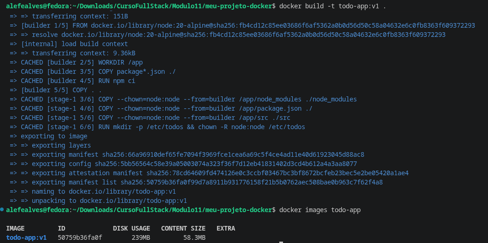
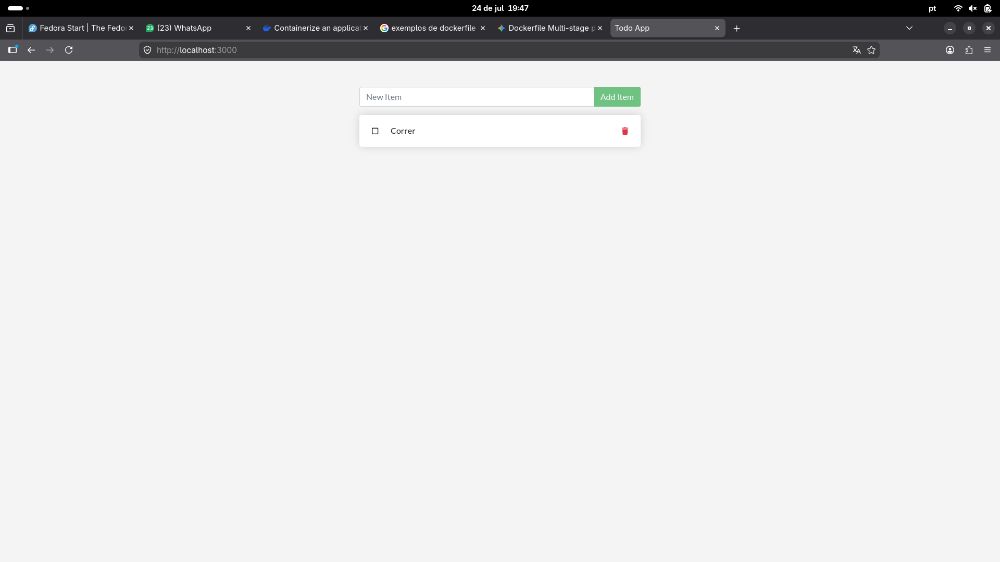
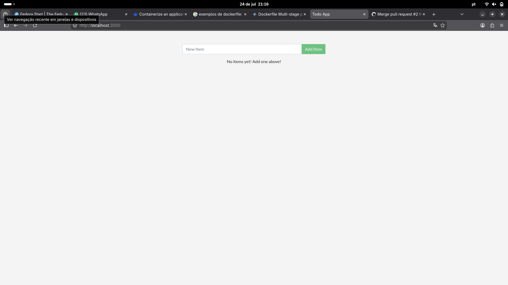
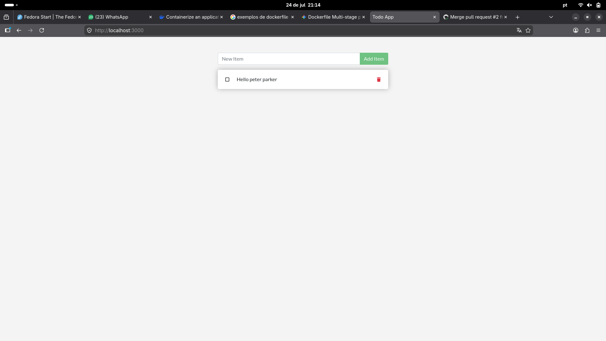
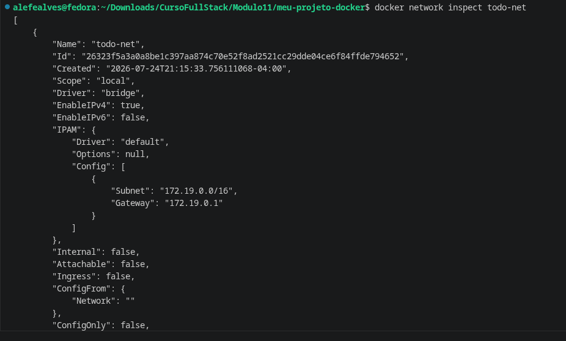
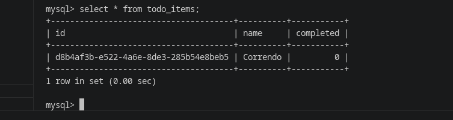
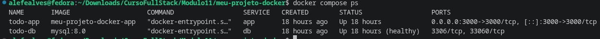
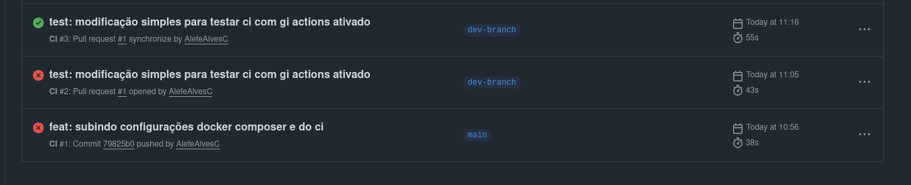
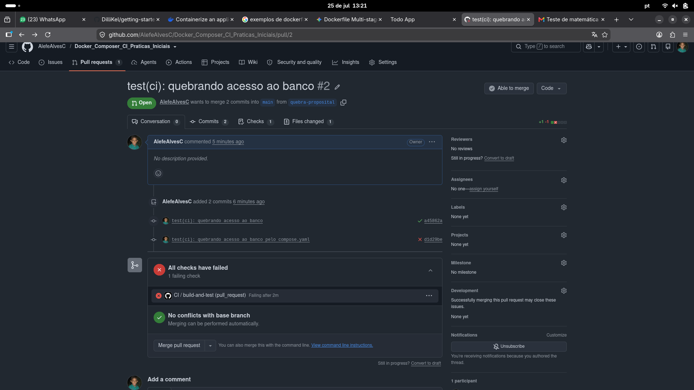

# Atividade Docker + CI — Álefe Alves da Costa

 
**Aluno(a):** Álefe Alves da Costa **Turma:** Noturno **Data:** 25/07/2026 **Aplicação usada:** docker/getting-started-app — To-Do em Node.js

## 1. Como executar este projeto

```bash
git clone https://github.com/AlefeAlvesC/Docker_Composer_CI_Praticas_Iniciais.git
cd Docker_Composer_CI_Praticas_Iniciais
cp .env.example .env
docker compose up -d --build
```

Depois de subir, **abra o navegador** e acesse:

```
http://localhost:3000
```

Para derrubar a aplicação:
- `docker compose down` — para e remove os containers, **mantém** os dados (o volume continua existindo)
- `docker compose down -v` — para tudo **e apaga** os dados (remove o volume também)

## 2. Imagem e Dockerfile multi-stage

**Estágios utilizados:** `builder` (instala as dependências com `npm ci`) e o estágio final (copia apenas `node_modules` + `src`, sem ferramentas de build).
**Imagem base:** `node:20-alpine`
**Usuário de execução:** `node` (não-root, já vem pronto na imagem `node:alpine`)
**Tamanho final da imagem:** ~58MB

**Por que o multi-stage ajuda?** Porque o estágio final só recebe o `node_modules` já pronto e o código-fonte — nada das ferramentas de build, cache do npm ou arquivos temporários do estágio `builder` vai parar na imagem final. Isso deixa a imagem menor (menos superfície de ataque, menos coisa pra escanear em busca de vulnerabilidade) e mais rápida de baixar/subir em produção.

**Print 1** — `docker build` + `docker images`


**Print 2** — aplicação rodando com tarefas cadastradas


## 3. Volumes e persistência

**Volume usado:** `todo-db` → montado em `/etc/todos` (container avulso, Parte 2) — no Compose, o volume equivalente é `todo-mysql-data` → `/var/lib/mysql`

**Print 3** — SEM volume: dados perdidos ao recriar o container


**Print 4** — COM volume: dados preservados


**Diferença entre `docker compose down` e `docker compose down -v`:** `down` para e remove os containers e a rede, mas mantém os volumes nomeados (os dados sobrevivem); `down -v` faz tudo isso **e também apaga os volumes**, perdendo os dados de vez.

## 4. Rede

**Rede criada:** `todo-net` **Serviços conectados:** app e mysql/db
**A porta do banco está exposta ao host?** Não — só o `app` precisa conversar com o banco, e essa comunicação já acontece dentro da rede Docker (`todo-net`); publicar a porta 3306 no host abriria o MySQL pra qualquer coisa rodando na máquina (ou na rede, dependendo do firewall), sem necessidade nenhuma.

**Por que o app consegue chamar o host `mysql`/`db` sem saber o IP?** Porque containers na mesma rede Docker (definida pelo usuário, seja via `docker network create` ou automaticamente pelo Compose) resolvem uns aos outros pelo nome — o Docker mantém um DNS interno que traduz o nome do serviço/container pro IP real, então o app só precisa saber o nome (`mysql` ou `db`), nunca o IP.

**Print 5** — `docker network inspect`


**Print 6** — dados dentro do MySQL (`select * from todo_items;`)


## 5. Docker Compose

**Serviços:** app, db **Rede:** `todo-net` · **Volume:** `todo-mysql-data`
**Healthcheck em:** db (`mysqladmin ping`) · **depends_on com:** `condition: service_healthy`
**Variáveis sensíveis:** carregadas via `.env` (não versionado). Modelo em `.env.example`.

**Print 7** — `docker compose ps`


## 6. Integração Contínua (GitHub Actions)

**Arquivo do workflow:** `.github/workflows/ci.yml` **Gatilhos:** push e pull_request
**O que o pipeline faz:**
1. Valida o `compose.yaml` (`docker compose config`)
2. Builda a imagem do serviço `app`
3. Sobe a stack (`docker compose up -d`)
4. Aguarda a app responder e testa criar uma tarefa via API (smoke test do CRUD)
5. Derruba a stack (`docker compose down -v`, sempre, mesmo se algo falhar)

**Print 8** — execução verde ✅ apesar de **ALGUMAS** tentativas erradas, no final deu certo!


## 7. Quebra proposital do CI

**O que eu quebrei:** troquei no arquivo`compose.yaml` a variável `MYSQL_PASSWORD: ${MYSQL_ROOT_PASSWORD}` por  `MYSQL_PASSWORD: ${MYSQL_PASSWORD}`.
**Erro que apareceu no log:** `Error: Process completed with exit code 1.`
**Como o CI reagiu:** o job passou pelo build normalmente (o Docker não valida se o arquivo do `CMD` existe na hora de buildar), mas falhou no step **"Aguardar a aplicação responder"** — o container do `app` subia e morria na hora e depois das 30 tentativas o step retornava `exit 1`.
**Como eu corrigi:** voltei a variável `MYSQL_PASSWORD: ${MYSQL_PASSWORD}` para sua versão correta `MYSQL_PASSWORD: ${MYSQL_ROOT_PASSWORD}`  , na mesma branch `quebra-proposital`, com um segundo commit.

**Link do Pull Request:** https://github.com/AlefeAlvesC/Docker_Composer_CI_Praticas_Iniciais/pull/2

**Print 9** — execução vermelha ❌ + log do erro


## 8. Dificuldades e aprendizados

Durante o desenvolvimento do projeto e a conteinerização da aplicação, alguns desafios técnicos foram superados:

### 1. Permissões de Usuário Não-Root no Docker (`USER node`)
* **Desafio:** Ao configurar o contêiner para rodar como usuário não-root por motivos de segurança, a aplicação falhava ao tentar criar diretórios locais (como `/etc/todos` para o SQLite).
* **Solução:** Ajustamos o `Dockerfile` para criar os diretórios necessários e alterar a propriedade deles (`chown -R node:node`) ainda na etapa de `root`, antes de alternar para a instrução `USER node`.

### 2. Ordem de Inicialização e Dependência do Banco de Dados
* **Desafio:** O contêiner da aplicação Node.js iniciava mais rápido do que o MySQL, tentando se conectar antes do banco estar pronto para aceitar conexões.
* **Solução:** Implementamos um `healthcheck` no serviço do MySQL (`db`) no `compose.yaml` e configuramos o `depends_on` da aplicação com a condição `service_healthy`.

### 3. Conflito de Variáveis no Usuário Root do MySQL
* **Desafio:** A tentativa de passar a variável `MYSQL_USER=root` na imagem oficial do MySQL causava erro no entrypoint do contêiner, pois o usuário `root` já é o padrão da imagem.
* **Solução:** Separamos as responsabilidades no `.env` e no Compose, utilizando apenas `MYSQL_ROOT_PASSWORD` para a configuração do banco e ajustando as variáveis da aplicação para autenticar com as credenciais do `root`.

### 4. Persistência de Dados no Docker Compose
* **Desafio:** Garantir o comportamento correto dos dados ao derrubar a stack de contêineres.
* **Solução:** Mapeamos os dados para um volume nomeado (`todo-mysql-data`), validando que o uso de `docker compose down` preserva o volume, enquanto `docker compose down -v` remove o volume e redefinindo o banco.

## 9. Checklist de autoavaliação

- [x] Dockerfile multi-stage funcionando
- [x] `.dockerignore` presente
- [x] Container não roda como root
- [x] Volume nomeado + persistência demonstrada
- [x] Rede nomeada + banco não exposto ao host
- [x] `compose.yaml` sobe tudo com um comando
- [x] `.env` no `.gitignore` e `.env.example` versionado
- [x] CI verde
- [x] PR com CI vermelho documentado ([#1](https://github.com/DilliKel/getting-started-docker/pull/1), merged)
- [x] Todos os 9 prints no README